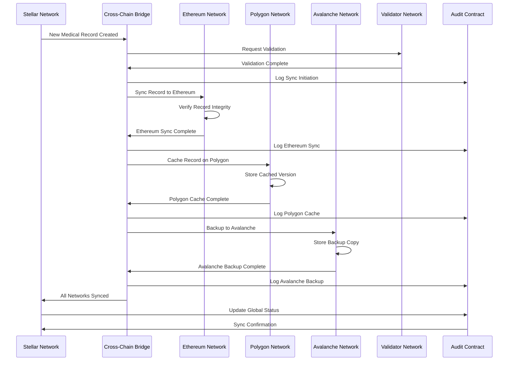
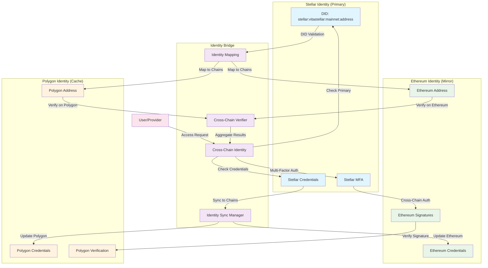
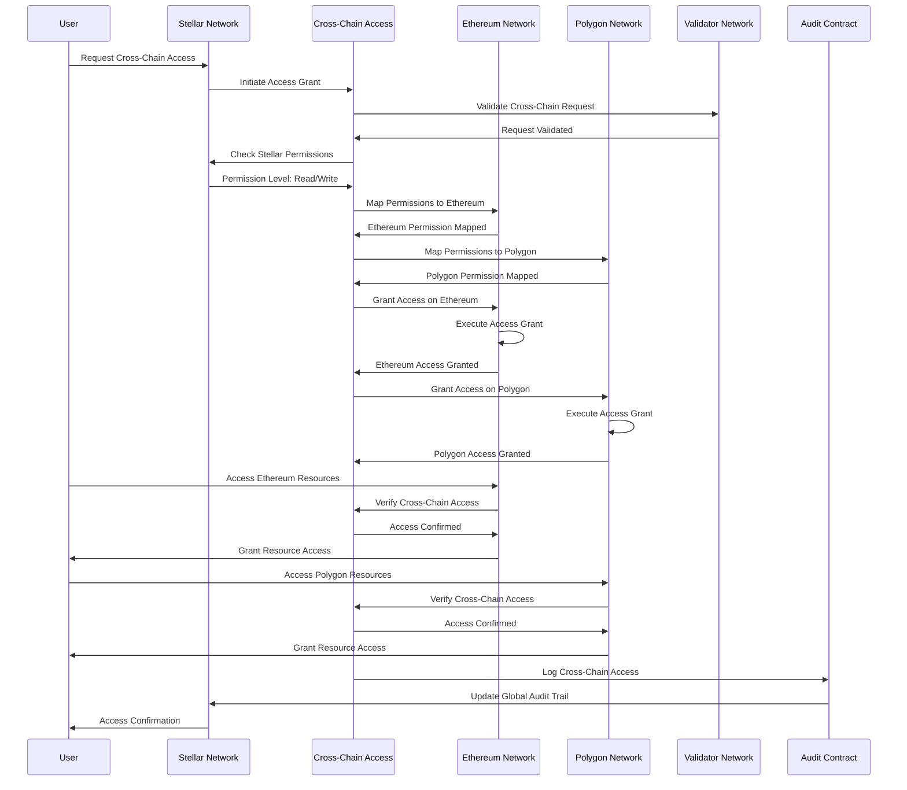
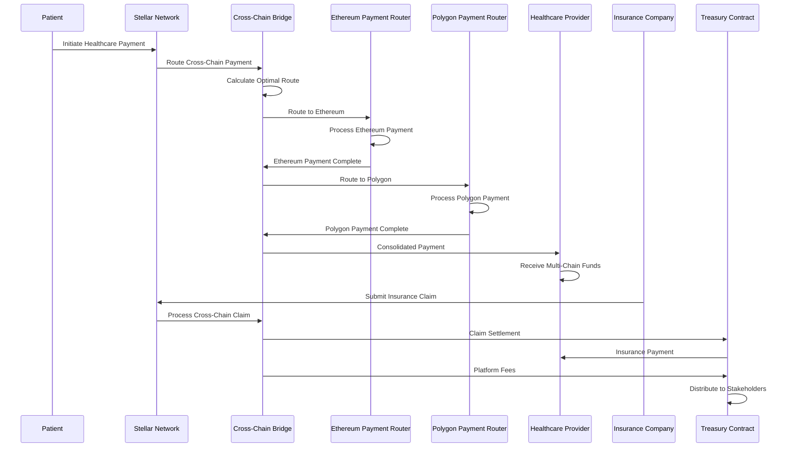
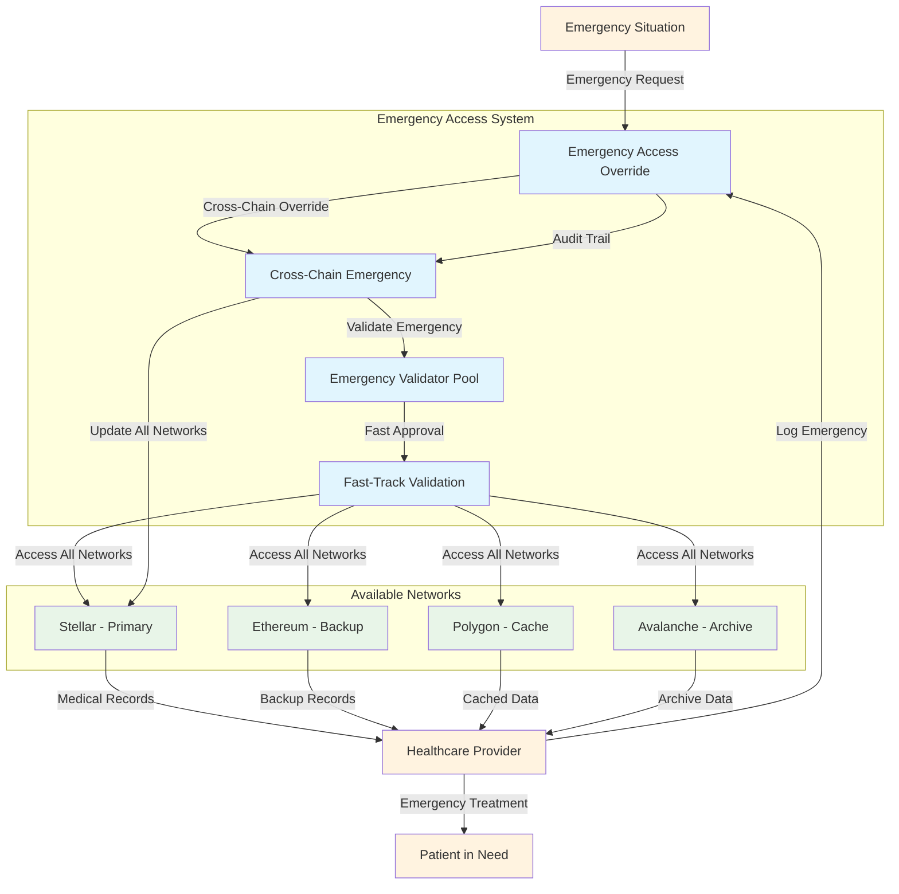

# Cross-Chain Interaction Flow Diagrams

## Multi-Chain Healthcare Data Architecture

```mermaid
graph TB
    %% Primary Stellar Network
    subgraph "Stellar Network (Primary)"
        STELLAR_CORE[Stellar Core]
        MR_STELLAR[Medical Records Contract]
        IR_STELLAR[Identity Registry]
        CC_BRIDGE[Cross-Chain Bridge]
        REG_NODE[Regional Node Manager]
    end

    %% Secondary Networks
    subgraph "Ethereum Network"
        ETH_CORE[Ethereum Core]
        MR_ETH[Medical Records Mirror]
        IR_ETH[Identity Mirror]
        ETH_BRIDGE[Ethereum Bridge]
    end

    subgraph "Polygon Network"
        POL_CORE[Polygon Core]
        MR_POL[Medical Records Cache]
        IR_POL[Identity Cache]
        POL_BRIDGE[Polygon Bridge]
    end

    subgraph "Avalanche Network"
        AVAX_CORE[Avalanche Core]
        MR_AVAX[Medical Records Backup]
        IR_AVAX[Identity Backup]
        AVAX_BRIDGE[Avalanche Bridge]
    end

    %% Cross-Chain Infrastructure
    subgraph "Cross-Chain Infrastructure"
        CC_ACCESS[Cross-Chain Access Control]
        CC_IDENTITY[Cross-Chain Identity]
        CC_ORCHESTRATOR[Multi-Region Orchestrator]
        RELAY_NETWORK[Relay Network]
        VALIDATOR_NETWORK[Validator Network]
    end

    %% External Systems
    subgraph "Healthcare Systems"
        EMR[EMR Systems]
        HOSPITAL[Hospital Networks]
        PHARMA[Pharma Systems]
        RESEARCH[Research Networks]
    end

    %% Connections - Primary to Secondary
    CC_BRIDGE -->|Data Sync| ETH_BRIDGE
    CC_BRIDGE -->|Cache Updates| POL_BRIDGE
    CC_BRIDGE -->|Backup Sync| AVAX_BRIDGE

    %% Bridge Connections
    ETH_BRIDGE --> MR_ETH
    POL_BRIDGE --> MR_POL
    AVAX_BRIDGE --> MR_AVAX

    %% Cross-Chain Access
    CC_ACCESS --> CC_BRIDGE
    CC_IDENTITY --> CC_ACCESS
    CC_ORCHESTRATOR --> REG_NODE

    %% External Integration
    EMR --> STELLAR_CORE
    HOSPITAL --> POL_CORE
    PHARMA --> ETH_CORE
    RESEARCH --> AVAX_CORE

    %% Relay and Validation
    RELAY_NETWORK --> CC_BRIDGE
    VALIDATOR_NETWORK --> CC_ACCESS

    %% Styling
    classDef stellar fill:#e1f5fe
    classDef ethereum fill:#e8f5e8
    classDef polygon fill:#fff3e0
    classDef avalanche fill:#f3e5f5
    classDef infrastructure fill:#fce4ec
    classDef external fill:#e0f2f1

    class STELLAR_CORE,MR_STELLAR,IR_STELLAR,CC_BRIDGE,REG_NODE stellar
    class ETH_CORE,MR_ETH,IR_ETH,ETH_BRIDGE ethereum
    class POL_CORE,MR_POL,IR_POL,POL_BRIDGE polygon
    class AVAX_CORE,MR_AVAX,IR_AVAX,AVAX_BRIDGE avalanche
    class CC_ACCESS,CC_IDENTITY,CC_ORCHESTRATOR,RELAY_NETWORK,VALIDATOR_NETWORK infrastructure
    class EMR,HOSPITAL,PHARMA,RESEARCH external
```

## Cross-Chain Medical Record Synchronization

## Cross-Chain Identity Verification Flow

## Cross-Chain Access Control Flow

## Regional Node Management and Load Balancing

```mermaid
graph TD
    %% Global Coordinator
    GLOBAL[Global Orchestrator]

    %% Regional Nodes
    subgraph "Africa Region"
        AFRICA_NODE[Africa Regional Node]
        AFRICA_CACHE[Africa Cache Layer]
        AFRICA_VALIDATOR[Africa Validator Set]
    end

    subgraph "Asia Region"
        ASIA_NODE[Asia Regional Node]
        ASIA_CACHE[Asia Cache Layer]
        ASIA_VALIDATOR[Asia Validator Set]
    end

    subgraph "Americas Region"
        AMERICAS_NODE[Americas Regional Node]
        AMERICAS_CACHE[Americas Cache Layer]
        AMERICAS_VALIDATOR[Americas Validator Set]
    end

    subgraph "Europe Region"
        EUROPE_NODE[Europe Regional Node]
        EUROPE_CACHE[Europe Cache Layer]
        EUROPE_VALIDATOR[Europe Validator Set]
    end

    %% Chain Connections
    subgraph "Connected Chains"
        STELLAR[Stellar Network]
        ETHEREUM[Ethereum Network]
        POLYGON[Polygon Network]
        AVALANCHE[Avalanche Network]
    end

    %% Load Balancing
    GLOBAL -->|Coordinate| AFRICA_NODE
    GLOBAL -->|Coordinate| ASIA_NODE
    GLOBAL -->|Coordinate| AMERICAS_NODE
    GLOBAL -->|Coordinate| EUROPE_NODE

    %% Regional Chain Connections
    AFRICA_NODE -->|Primary| STELLAR
    AFRICA_NODE -->|Secondary| ETHEREUM
    ASIA_NODE -->|Primary| STELLAR
    ASIA_NODE -->|Secondary| POLYGON
    AMERICAS_NODE -->|Primary| STELLAR
    AMERICAS_NODE -->|Secondary| AVALANCHE
    EUROPE_NODE -->|Primary| STELLAR
    EUROPE_NODE -->|Secondary| ETHEREUM

    %% Cache Layers
    AFRICA_NODE --> AFRICA_CACHE
    ASIA_NODE --> ASIA_CACHE
    AMERICAS_NODE --> AMERICAS_CACHE
    EUROPE_NODE --> EUROPE_CACHE

    %% Validators
    AFRICA_CACHE --> AFRICA_VALIDATOR
    ASIA_CACHE --> ASIA_VALIDATOR
    AMERICAS_CACHE --> AMERICAS_VALIDATOR
    EUROPE_CACHE --> EUROPE_VALIDATOR

    classDef orchestrator fill:#e1f5fe
    classDef region fill:#e8f5e8
    classDef cache fill:#fff3e0
    classDef validator fill:#f3e5f5
    classDef chain fill:#fce4ec

    class GLOBAL orchestrator
    class AFRICA_NODE,ASIA_NODE,AMERICAS_NODE,EUROPE_NODE region
    class AFRICA_CACHE,ASIA_CACHE,AMERICAS_CACHE,EUROPE_CACHE cache
    class AFRICA_VALIDATOR,ASIA_VALIDATOR,AMERICAS_VALIDATOR,EUROPE_VALIDATOR validator
    class STELLAR,ETHEREUM,POLYGON,AVALANCHE chain
```

## Cross-Chain Payment and Settlement Flow

## Cross-Chain Emergency Response Flow

## Cross-Chain Data Consistency and Validation

```mermaid
graph LR
    %% Data Sources
    STELLAR_DATA[Stellar Source Data]
    ETH_DATA[Ethereum Mirror Data]
    POL_DATA[Polygon Cache Data]
    AVAX_DATA[Avalanche Backup Data]

    %% Validation Layer
    subgraph "Validation System"
        HASH_VALIDATOR[Hash Validator]
        CONSENSUS_CHECK[Consensus Checker]
        INTEGRITY_CHECK[Integrity Verifier]
        VERSION_CONTROL[Version Control]
    end

    %% Consistency Management
    subgraph "Consistency Management"
        CONFLICT_RESOLUTION[Conflict Resolution]
        SYNC_MANAGER[Sync Manager]
        STATE_RECONCILIATION[State Reconciliation]
        FINALITY_TRACKER[Finality Tracker]
    end

    %% Validation Flow
    STELLAR_DATA -->|Source Hash| HASH_VALIDATOR
    ETH_DATA -->|Mirror Hash| HASH_VALIDATOR
    POL_DATA -->|Cache Hash| HASH_VALIDATOR
    AVAX_DATA -->|Backup Hash| HASH_VALIDATOR

    HASH_VALIDATOR -->|Hash Comparison| CONSENSUS_CHECK
    CONSENSUS_CHECK -->|Consensus Status| INTEGRITY_CHECK
    INTEGRITY_CHECK -->|Integrity Report| VERSION_CONTROL

    %% Consistency Flow
    VERSION_CONTROL -->|Version Check| CONFLICT_RESOLUTION
    CONFLICT_RESOLUTION -->|Resolve Conflicts| SYNC_MANAGER
    SYNC_MANAGER -->|Sync Data| STATE_RECONCILIATION
    STATE_RECONCILIATION -->|Reconcile State| FINALITY_TRACKER

    %% Feedback Loop
    FINALITY_TRACKER -->|Finality Status| STELLAR_DATA
    FINALITY_TRACKER -->|Update Status| ETH_DATA
    FINALITY_TRACKER -->|Update Status| POL_DATA
    FINALITY_TRACKER -->|Update Status| AVAX_DATA

    classDef source fill:#e1f5fe
    classDef validation fill:#e8f5e8
    classDef consistency fill:#fff3e0

    class STELLAR_DATA,ETH_DATA,POL_DATA,AVAX_DATA source
    class HASH_VALIDATOR,CONSENSUS_CHECK,INTEGRITY_CHECK,VERSION_CONTROL validation
    class CONFLICT_RESOLUTION,SYNC_MANAGER,STATE_RECONCILIATION,FINALITY_TRACKER consistency
```

## Key Cross-Chain Features

### **1. Multi-Chain Architecture**
- **Primary Network**: Stellar for main healthcare data
- **Mirror Networks**: Ethereum for critical data redundancy
- **Cache Networks**: Polygon for fast access
- **Archive Networks**: Avalanche for long-term storage

### **2. Cross-Chain Identity**
- **Unified DID**: Single identity across all chains
- **Credential Sync**: Verifiable credentials synchronized
- **Authentication Bridge**: Cross-chain authentication
- **Recovery Coordination**: Multi-chain recovery support

### **3. Data Synchronization**
- **Real-time Sync**: Immediate data propagation
- **Eventual Consistency**: Guaranteed data consistency
- **Conflict Resolution**: Automated conflict handling
- **Version Control**: Track data changes across chains

### **4. Access Control**
- **Permission Mapping**: Cross-chain permission translation
- **Dynamic Grants**: Real-time access management
- **Audit Trail**: Unified audit across networks
- **Emergency Override**: Cross-chain emergency access

### **5. Payment and Settlement**
- **Multi-Chain Routing**: Optimal payment paths
- **Currency Conversion**: Cross-chain token swaps
- **Settlement Coordination**: Unified settlement system
- **Fee Distribution**: Automated fee allocation
- **Reentrancy Guarding**: Timelock-to-escrow release paths include cross-contract guard checks

### **6. Regional Management**
- **Geographic Distribution**: Regional node deployment
- **Load Balancing**: Intelligent traffic distribution
- **Latency Optimization**: Region-specific routing
- **Failover Support**: Automatic failover mechanisms

This cross-chain architecture provides a robust, scalable, and resilient foundation for global healthcare data management while ensuring data consistency, security, and accessibility across multiple blockchain networks.
